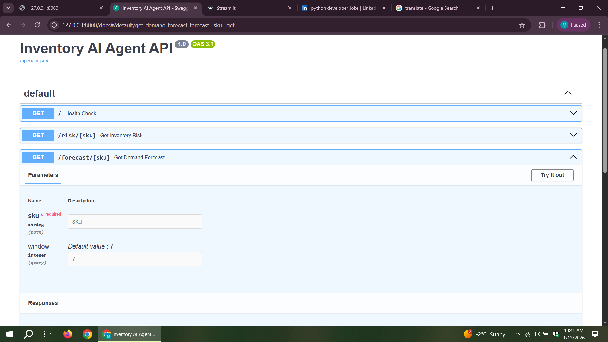
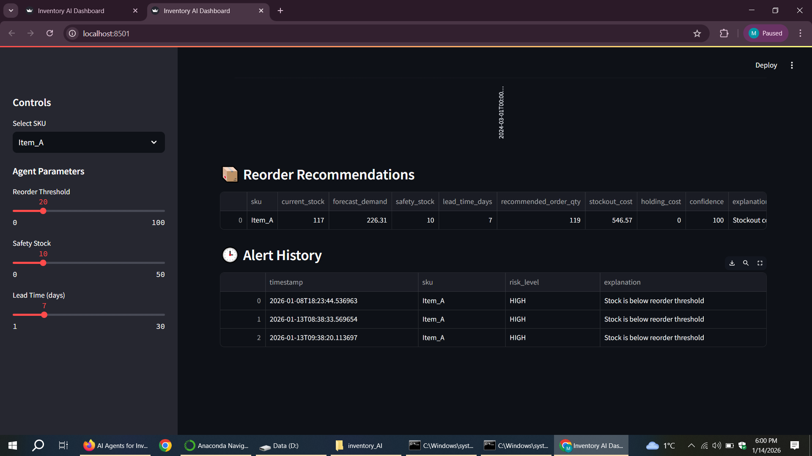

# 🧠 Multi-Agent Inventory Intelligence System

A production-style AI agent system for inventory risk monitoring, demand forecasting, anomaly detection, and intelligent reorder decisions.

---

## 🚀 Features

### FastAPI Backend
- Inventory risk assessment API
- Demand forecasting API
- Swagger (OpenAPI) documentation

### AI Agents
- Inventory risk classification agent
- Demand forecasting agent (window-based)
- Sales anomaly detection agent
- Forecast-aware reorder decision agent

### Streamlit Dashboard
- Human-in-the-loop controls
- Real-time API integration
- Risk visualization & alerts
- Forecast charts & reorder recommendations

---

## 🧰 Tech Stack

- Python
- FastAPI
- Streamlit
- Pandas / NumPy
- REST APIs
- Multi-Agent Architecture

---

## 📊 Example Use Cases

- Detect inventory risk before stockouts occur
- Forecast short-term demand
- Identify sales anomalies
- Generate cost-aware reorder recommendations

---

## ▶️ How to Run the Project

### 1️⃣ Start the FastAPI backend
```bash
uvicorn api.main:app --reload

---

## 📸 Dashboard Screenshots

### Inventory Risk Analysis


### Demand Forecasting View


### Reorder Recommendation


---

## ⚙️ How to Run the Project

### 1️⃣ Start FastAPI Backend
```bash
uvicorn api.main:app --reload

