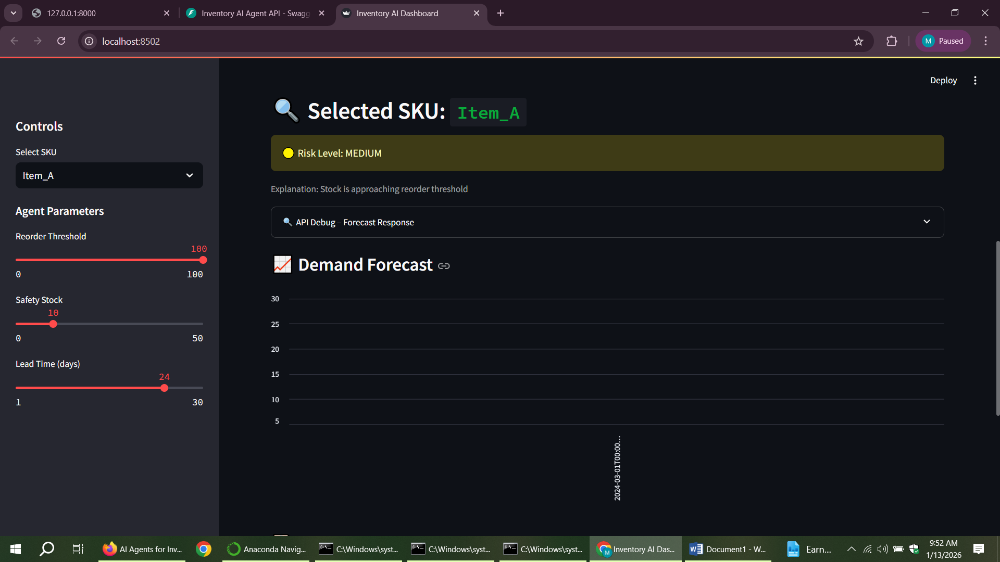
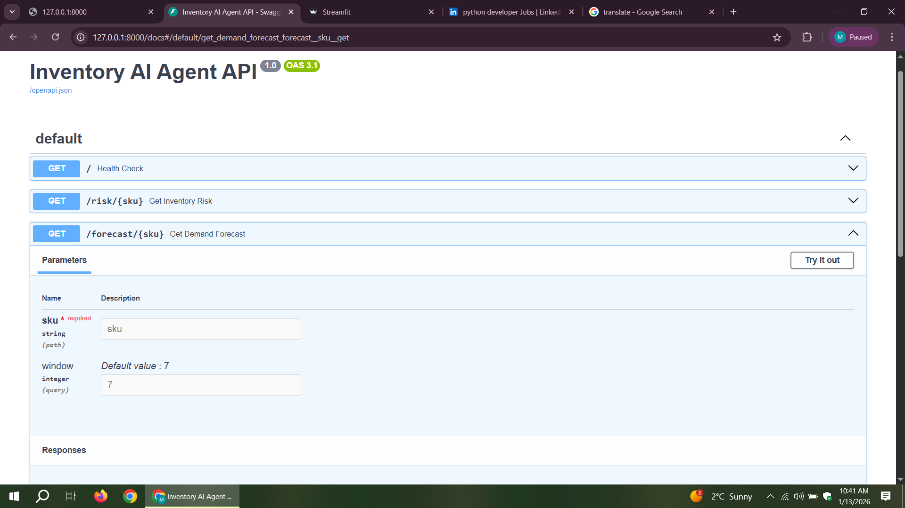
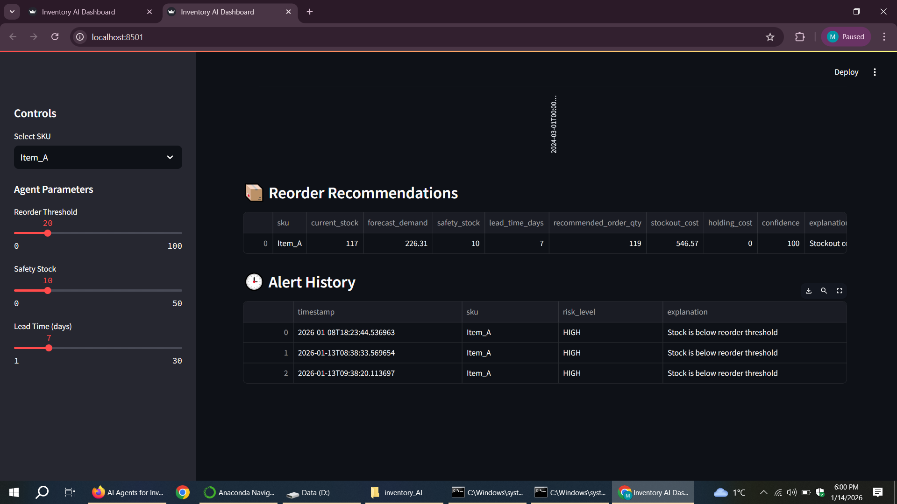

# 🧠 Multi-Agent Inventory Intelligence System

A production-style AI agent system for inventory risk monitoring, demand forecasting, anomaly detection, and intelligent reorder decisions.

---

## 🚀 Features

### FastAPI Backend
- Inventory risk assessment API
- Demand forecasting API
- Swagger (OpenAPI) documentation

### AI Agents
- Inventory risk classification agent
- Demand forecasting agent (window-based)
- Sales anomaly detection agent
- Forecast-aware reorder decision agent

### Streamlit Dashboard
- Human-in-the-loop controls
- Real-time API integration
- Risk visualization & alerts
- Forecast charts & reorder recommendations

---

## 🧰 Tech Stack

- Python
- FastAPI
- Streamlit
- Pandas / NumPy
- REST APIs
- Multi-Agent Architecture

---

## 📊 Example Use Cases

- Detect inventory risk before stockouts occur
- Forecast short-term demand
- Identify sales anomalies
- Generate cost-aware reorder recommendations

---

## ▶️ How to Run the Project

### 1️⃣ Start the FastAPI backend
```bash
uvicorn api.main:app --reload

---

## 📸 Dashboard Screenshots

### Inventory Risk Analysis


### Demand Forecasting View


### Reorder Recommendation


---

## ⚙️ How to Run the Project

### 1️⃣ Start FastAPI Backend
```bash
uvicorn api.main:app --reload

#  AI-Powered Multi-Agent Inventory Intelligence System

An **AI-powered multi-agent inventory management system** that monitors inventory, analyzes demand, detects anomalies, evaluates stock risk, recommends reorder actions, and generates intelligent alerts.

The system combines **multiple specialized AI agents**, a **FastAPI backend**, an interactive **inventory dashboard**, and **AWS EC2 deployment** to provide automated inventory decision support.

---

##  Project Overview

Traditional inventory systems often rely on fixed thresholds and manual monitoring.

This project uses a **multi-agent architecture** where each agent performs a specialized task and contributes to the overall inventory intelligence workflow.

### Main Capabilities

-  Inventory monitoring
-  Demand forecasting
-  Anomaly detection
-  Inventory risk analysis
-  Reorder recommendations
-  Automated alerts
-  Alert history tracking
-  SKU retry and suggestion logic
-  API key authentication
-  REST API using FastAPI
-  AWS EC2 deployment
-  Nginx reverse proxy
-  Systemd service for automatic API startup

---

##  Multi-Agent Architecture

```text
                         ┌─────────────────────┐
                         │       User          │
                         └──────────┬──────────┘
                                    │
                                    ▼
                         ┌─────────────────────┐
                         │ Inventory Dashboard │
                         └──────────┬──────────┘
                                    │
                                    ▼
                         ┌─────────────────────┐
                         │     FastAPI API     │
                         └──────────┬──────────┘
                                    │
              ┌─────────────────────┼─────────────────────┐
              │                     │                     │
              ▼                     ▼                     ▼
     ┌────────────────┐   ┌────────────────┐   ┌────────────────┐
     │ Inventory      │   │ Demand         │   │ Anomaly        │
     │ Monitor Agent  │   │ Forecast Agent │   │ Detection Agent│
     └───────┬────────┘   └───────┬────────┘   └───────┬────────┘
             │                    │                    │
             └────────────────────┼────────────────────┘
                                  │
                                  ▼
                       ┌────────────────────┐
                       │ Risk Analysis /    │
                       │ Decision Layer     │
                       └─────────┬──────────┘
                                 │
                    ┌────────────┼────────────┐
                    ▼            ▼            ▼
             ┌────────────┐ ┌───────────┐ ┌──────────────┐
             │ Reorder    │ │ Alert     │ │ Alert History│
             │ Agent      │ │ Agent     │ │ Agent        │
             └────────────┘ └───────────┘ └──────────────┘
```
---
##AI Agents
### 1. 📦 Inventory Monitor Agent

Monitors inventory levels for individual SKUs and provides current stock-related information.

### Responsibilities:

Monitor stock levels
Analyze inventory status
Identify potential stock problems
Provide SKU-level inventory information
---
## 2. 📈 Demand Forecast Agent

Analyzes historical inventory and sales information to estimate future demand.

### Responsibilities:

Analyze historical sales
Generate demand forecasts
Support inventory planning
Help determine future stock requirements
---
## Anomaly Detection Agent

Identifies unusual patterns in inventory and sales behavior.

### Responsibilities:

Detect unusual inventory behavior
Identify abnormal sales patterns
Support early detection of potential inventory problems
---
## 4. Risk Analysis Agent

Evaluates inventory conditions and determines the overall inventory risk.

The system categorizes inventory risk into:

🟢 LOW
🟡 MEDIUM
🔴 HIGH

The risk analysis considers inventory conditions and reorder thresholds to provide an understandable explanation.
---
## 5. Reorder Agent

Provides reorder recommendations based on inventory conditions.

### Responsibilities:

Identify products requiring replenishment
Recommend reorder actions
Support inventory decision-making
---
## 6. 🔔 Alert Agent

Generates alerts when inventory conditions require attention.

### Responsibilities:

Generate inventory alerts
Prevent unnecessary duplicate alerts
Notify about important inventory conditions
---
## 7. 📋 Alert History Agent

Maintains historical information about generated inventory alerts.

### Responsibilities:

1.Track previous alerts
2.Maintain alert history
3.Support monitoring and analysis of inventory events
---
## 🔄 Intelligent Retry & SKU Handling

The API includes robust SKU handling.

If a user provides an invalid SKU, the API:

### Normalizes the SKU input.
** Checks whether the SKU exists.
** Returns the available SKUs.
** Provides a retry indication.
** Allows the user/system to retry using a valid SKU.

SKU matching is case-insensitive.
---
## 🔐 API Security

The FastAPI backend uses API key authentication to protect the inventory endpoints.

Requests must include an API key through the HTTP header:
curl -X GET "http://YOUR_SERVER_IP/risk/item_a?reorder_threshold=20" \
  -H "x-api-key: YOUR_API_KEY"
  ---
  ## 🚀 API Endpoints
### Health Check
GET /

Used to verify that the API is running.
---
## Inventory Risk
GET /risk/{sku}
### Example 
GET /risk/item_a?reorder_threshold=20
### Example response:
{
  "sku": "item_a",
  "risk_level": "LOW",
  "explanation": "Stock level is healthy"
}
---
## Demand Forecast
GET /forecast/{sku}

### Example:

GET /forecast/item_a?window=7

The endpoint generates a demand forecast based on the selected forecasting window.
---
### Dashboard

The project includes an interactive dashboard for visualizing inventory intelligence and AI-generated recommendations.
